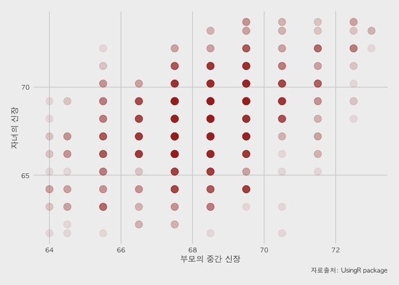
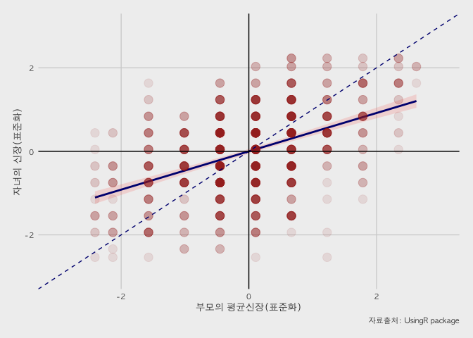
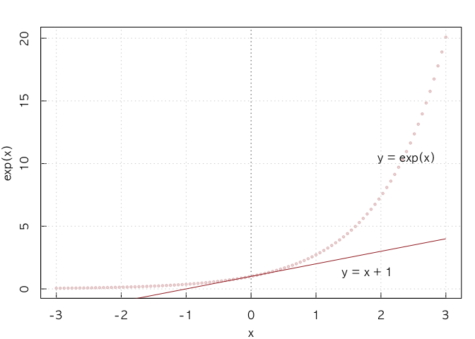

\`사회과학자를 위한 데이터 과학’ 코드 저장소 이용방법
================
박종희
2020-09-25

## 소개

이 문서는 **사회과학자를 위한 데이터 과학**(박종희 2020)에 소개된 **R**코드를 다운 받아 사용하는 방법을 소개합니다.

## 사용방법

먼저 현재 사용자의 **R** 워킹 디렉토리를 확인합니다. 이 곳에 집파일을 다운 받아 풀 것입니다.

``` r
## 현재 워킹 디렉토리가 어디인지 확인
getwd()
```

    ## [1] "/Users/park/Dropbox/STABLE-202006"

``` r
## 필요하면 원하는 위치로 변경: "."을 "where/you/want"로 바꾸면 됨.
## setwd(dir = ".")
```

전체코드를 집파일로 다운로드 받습니다. 깃허브의 “Download ZIP” 버튼을 이용해서 수동으로 진행해도
됩니다.

``` r
download.file(url = "https://github.com/jongheepark/BayesianSocialScience/archive/master.zip", 
              destfile = "BayesianSocialScience-master.zip")
```

다운받은 파일을 풉(unzip)니다.

``` r
unzip(zipfile = "BayesianSocialScience-master.zip")
```

폴더 안의 파일들을 확인합니다.

``` r
list.files("BayesianSocialScience-master")
```

    ##  [1] "01-intro.R"                                       
    ##  [2] "02-probability.R"                                 
    ##  [3] "03-distribution.R"                                
    ##  [4] "04-association.R"                                 
    ##  [5] "05-regression.R"                                  
    ##  [6] "06-ols.R"                                         
    ##  [7] "07-mle.R"                                         
    ##  [8] "08-bayes.R"                                       
    ##  [9] "09-bayesinference.R"                              
    ## [10] "10-history.R"                                     
    ## [11] "11-extension.R"                                   
    ## [12] "12-network.R"                                     
    ## [13] "index.R"                                          
    ## [14] "long-term-cereal-yields-in-the-united-kingdom.csv"
    ## [15] "README.md"

해당 폴더로 디렉토리 위치를 변경한 뒤, Ch.5에 나온 회귀분석 예제를 실행해 봅니다.

``` r
setwd("BayesianSocialScience-master")
source("05-regression.R", echo=TRUE)
```

    ## 
    ## R > source("index.R")
    ## 
    ## R > library(UsingR)
    ## 
    ## R > data(galton)
    ## 
    ## R > ggplot(galton, aes(x = parent, y = child)) + geom_point(size = 4, 
    ## +     alpha = 0.1, col = "brown") + xlab("부모의 중간 신장") + 
    ## +     ylab("자녀의 신장") + .... [TRUNCATED]

<!-- -->

    ## 
    ## R > center <- function(x) {
    ## +     out <- (x - mean(x, na.rm = TRUE))/sd(x, na.rm = TRUE)
    ## +     return(out)
    ## + }
    ## 
    ## R > galton.cen <- data.frame(apply(galton, 2, center))
    ## 
    ## R > rho.test <- cor.test(galton.cen[, 1], galton.cen[, 
    ## +     2])
    ## 
    ## R > rho.test
    ## 
    ##  Pearson's product-moment correlation
    ## 
    ## data:  galton.cen[, 1] and galton.cen[, 2]
    ## t = 15.711, df = 926, p-value < 2.2e-16
    ## alternative hypothesis: true correlation is not equal to 0
    ## 95 percent confidence interval:
    ##  0.4064067 0.5081153
    ## sample estimates:
    ##       cor 
    ## 0.4587624 
    ## 
    ## 
    ## R > rho <- rho.test$estimate
    ## 
    ## R > galton.lm <- lm(child ~ parent, data = galton.cen)
    ## 
    ## R > stargazer(galton.lm, header = FALSE, type = "latex", 
    ## +     title = "골튼의 신장유전 자료에 대한 회귀분석: 자녀의 신장 ~ 부모의 중간 신장", 
    ## +     label = "galton.reg")
    ## 
    ## \begin{table}[!htbp] \centering 
    ##   \caption{골튼의 신장유전 자료에 대한 회귀분석: 자녀의 신장 ~ 부모의 중간 신장} 
    ##   \label{galton.reg} 
    ## \begin{tabular}{@{\extracolsep{5pt}}lc} 
    ## \\[-1.8ex]\hline 
    ## \hline \\[-1.8ex] 
    ##  & \multicolumn{1}{c}{\textit{Dependent variable:}} \\ 
    ## \cline{2-2} 
    ## \\[-1.8ex] & child \\ 
    ## \hline \\[-1.8ex] 
    ##  parent & 0.459$^{***}$ \\ 
    ##   & (0.029) \\ 
    ##   & \\ 
    ##  Constant & 0.000 \\ 
    ##   & (0.029) \\ 
    ##   & \\ 
    ## \hline \\[-1.8ex] 
    ## Observations & 928 \\ 
    ## R$^{2}$ & 0.210 \\ 
    ## Adjusted R$^{2}$ & 0.210 \\ 
    ## Residual Std. Error & 0.889 (df = 926) \\ 
    ## F Statistic & 246.839$^{***}$ (df = 1; 926) \\ 
    ## \hline 
    ## \hline \\[-1.8ex] 
    ## \textit{Note:}  & \multicolumn{1}{r}{$^{*}$p$<$0.1; $^{**}$p$<$0.05; $^{***}$p$<$0.01} \\ 
    ## \end{tabular} 
    ## \end{table} 
    ## 
    ## R > ggplot(galton.lm, aes(x = parent, y = child)) + geom_smooth(method = "lm", 
    ## +     aes(fill = "confidence"), show.legend = F, alpha = 0.2, col = "n ..." ... [TRUNCATED]

<!-- -->

    ## 
    ## R > x <- seq(-3, 3, length = 100)
    ## 
    ## R > plot(x, exp(x), col = addTrans("brown", 50), type = "p", 
    ## +     cex = 0.5, pch = 19)

<!-- -->

    ## 
    ## R > grid()
    ## 
    ## R > abline(v = 0, col = "gray40", lty = 3)
    ## 
    ## R > lines(x, x + 1, col = "brown", lwd = 1)
    ## 
    ## R > text(x[90], exp(x[90]) - 0.5, "y = exp(x)")
    ## 
    ## R > text(x[80], x[80] - 0.5, "y = x + 1")
    ## 
    ## R > DiagrammeR::grViz("digraph {\n  graph [layout = dot, rankdir = TB]\n  \n  node [shape = rectangle]        \n  rec1 [label = 'Step 1. Significance' ..." ... [TRUNCATED]
